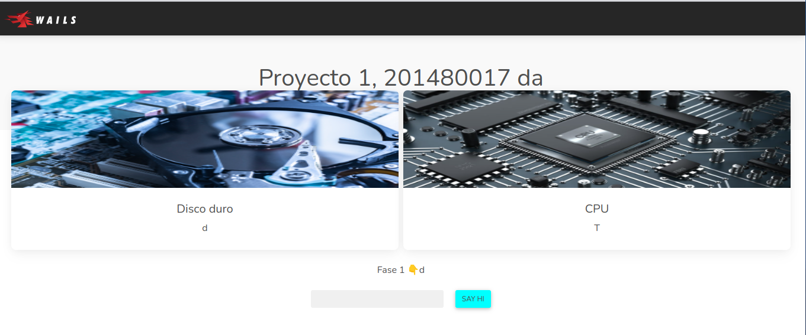

# Proyecto 1 fase 1, Sistemas operativos 2

## comandos basicos, Golang
-   iniciar proyecto
    -   >   go mod init main.go
    -   >   go mod tidy

-   correr programa
    -   >   go run main.go
-   compilar programa
    -   >   go build main.go
    -   correr programa compilado.
        -   >   ./main   
---
## Fuentes de consulta
-   Visualizar informacion de CPU (myPackages/cpu.go)
    -   >   https://stackoverflow.com/questions/11356330/how-to-get-cpu-usage
-   Visualizar el Consumo de Disco (myPackages/disk.go)
    -   >   https://www.includehelp.com/golang/get-the-disk-usage-information.aspx#:~:text=In%20the%20Go%20programming%20language,to%20get%20the%20filesystem%20statistics.
-   Wails
    -   >   https://golang.ch/introduction-to-wails-desktop-apps-in-golang/

    -   >   https://github.com/plutov/packagemain/tree/master/16-wails-desktop-app 
    -   >   https://github.com/dedSyn4ps3/wails-react-demo
---
## Wails

-   Instalar
    -   >   go install github.com/wailsapp/wails/v2/cmd/wails@latest
-   Crear un nuevo proyecto de Wails
    -   >   wails init -t vanilla -n wails-hello-world    
-   ### comandos

    vercion de wails
    -   >   wails setup
    
    crear proyecto, usando react
    -   >   wails init -n "Nombre_proyecto" -t 
    
    correr el proyecto (estar en el directorio)
    -   >   cd wails-react-demo
    -   >   wails dev
        
        Se activa en:
        -   >   http://localhost:5173/
             
            

                
            
 

---
## BackEnd

-   Ejecutar backe en go, muestra el porcentaje de CPU actual y la cantidad de disco duro utilizado
    -   >   cd backEnd
    -   >   go run main.go
     
    

        
    
 

