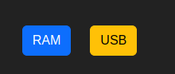

# Proyecto 1 fase 2,  Laboratorio de Sistemas Operativos 2

# Manual de Usuario

## Para ingresar al Login, se necesitan las siguiente credenciales
Usuario:
- > erick

Contrasena:
- > 123

## Al ingresar, se presentan dos botones

 
- RAM
    - presenta el consumo actual de memoria ram en el sistema, utilizando golang como motor.
    - 