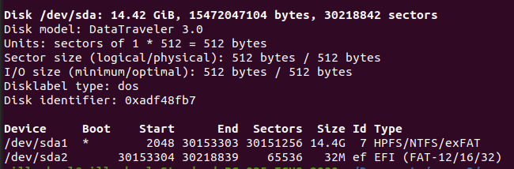

# Instalacion Ubuntu
 - sudo apt install golang
 - sudo apt install git
 - sudo snap install --classic code
 - git clone https://github.com/ErickBernal/sopes2.git

 # Mount y Umount usb en linea de comandos

Para el punto de montaje de la ```usb```,
 Crear el directorio ```/media/usb```
 ```sh
    sudo mkdir /media/usb
  ```

Verificar la direccion del dispositivo usb ```(/dev/sda1)```

```sh
    sudo fdisk -l
 ```
- 

Creando archivo [Mount.sh](mount.sh)
- Darle permisos de ejcucion
- > chmod +x mount.sh

Creando archivo [Umount.sh](umount.sh)
- Darle permisos de ejcucion
- > chmod +x umount.sh

Comprobar funcionamiento 
- > ./mount.sh
- > ./umount.sh


# Desarrollo de Golang


```sh
    d
 ```


