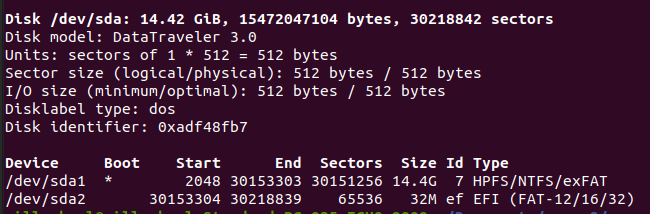

# Manual tecnico
```sh
 Nota: es necesario que el dispostivo usb se encuentre desmontado para utilizar el programa, usar "umout.sh"
 ```
 
# Instalacion Ubuntu
 - sudo apt install golang
 - sudo apt install git
 - sudo snap install --classic code
 - git clone https://github.com/ErickBernal/sopes2.git

 # Mount y Umount usb en linea de comandos 

Para el punto de montaje de la ```usb```,
 Crear el directorio ```/media/usb```
 ```sh
    sudo mkdir /media/usb
  ```

Verificar la direccion del dispositivo usb ```(/dev/sda1)```, esta direccion sera usada en los archivos [Mount.sh](mount.sh) y [Umount.sh](umount.sh)

```sh
    sudo fdisk -l
 ```
- 

Creando archivo [Mount.sh](mount.sh)
- Darle permisos de ejcucion
- > chmod +x mount.sh

Creando archivo [Umount.sh](umount.sh)
- Darle permisos de ejcucion
- > chmod +x umount.sh

Comprobar funcionamiento 
- > ./mount.sh
- > ./umount.sh


# Desarrollo Log
---
## Creamos [Log.sh](log.sh)
- Darle permisos de ejcucion
- > chmod +x log.sh
---
## Comandos
```Nota```: posicionarse desde ```proyecto1_fase2/usb```

- Limpiando la carpeta ```datos```, en la cual se contendran los datos copiados desde la usb
   - > rm -rf datos

- Eliminar archivo ```log.txt```
   - > rm log.txt

- Copiando y generando el arbol de archivos, desde ```/usb``` a ```/datos``` 
   - > rsync -av --progress /media/usb datos | tee -a log.txt

### Explicacion de comando ```rsync```
$ rsync -av --progress ```</ruta/de/la/usb>``` ```</ruta/de/la/copia>``` | tee -a ```</ruta/del/archivo/log.txt>```


| Parametro | Descripción |
| ------ | ----------- |
| -av    | Indica que se copiarán los archivos en modo "archivo" y "verborrágico", lo que significa que mostrará información detallada de la operación en la consola. |
| --progress | Muestra el progreso de la copia. |
| /ruta/de/la/usb | Es la ruta de la USB que quieres copiar. [paso1]()|
| /ruta/de/la/copia | Es la ruta donde deseas guardar los archivos copiados. |
| &#124; tee -a /ruta/del/archivo/registro.txt | Redirecciona la salida del comando rsync a tee, que muestra la salida en la consola y también agrega la salida al archivo de registro. |


