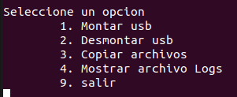
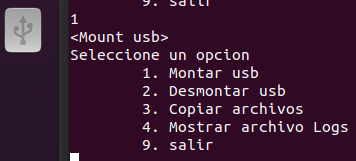
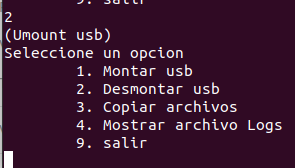
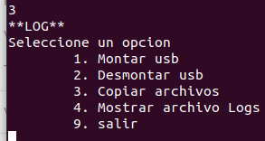
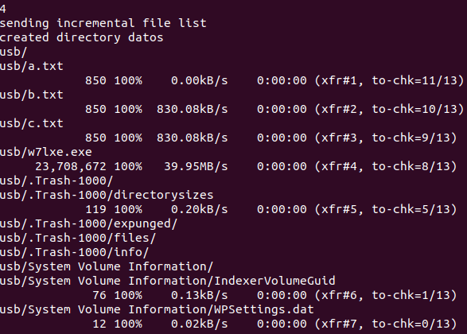

# Manual Usuario
Menu de seleccion de la aplicacion
- 

Descripcion de funciones
- 1. Monta la usb en un directorio comun en ```/media/usb```
    - 
- 2. Desmonta un Usb 
    - 
- 3. Copia todos los archivos que se encuentrene en la usb hacia un directorio del proyecto ```/datos/usb```
    - 
- 4. Muestra el archivo ```log.txt```, en el que se encuentran listados todos los archivos copiados.
    - 
- 9. Salida de la aplicacion.